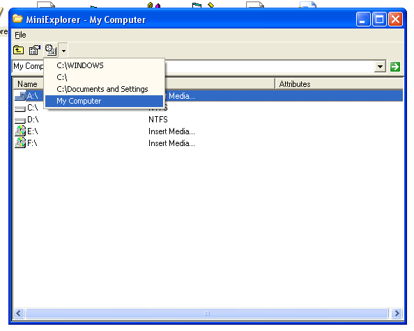

<div align="center">

## MiniExplorer


</div>

### Description

Explorer

Includes Drag and drop from windows to listview both files and folders and back.

File System Object Information.

Command Line Switches.

Special Folder API IE(My Documents, Network Neighborhood etc)
 
### More Info
 
':....References: Make sure to include these in your project....:

' :....Visual Basic For Applications....:

' :....Visual Basic runtime objects and procedures....:

' :....OLE Automation....:

' :....Microsoft Scripting Runtime....:

'Project..References From the Main Menu Or Alt+P+N


<span>             |<span>
---                |---
**Submitted On**   |2002-07-03 23:55:04
**By**             |[Morpheous](https://github.com/Planet-Source-Code/PSCIndex/blob/master/ByAuthor/morpheous.md)
**Level**          |Intermediate
**User Rating**    |4.3 (17 globes from 4 users)
**Compatibility**  |VB 6\.0
**Category**       |[Complete Applications](https://github.com/Planet-Source-Code/PSCIndex/blob/master/ByCategory/complete-applications__1-27.md)
**World**          |[Visual Basic](https://github.com/Planet-Source-Code/PSCIndex/blob/master/ByWorld/visual-basic.md)
**Archive File**   |[MiniExplor101667742002\.zip](https://github.com/Planet-Source-Code/morpheous-miniexplorer__1-36535/archive/master.zip)

### API Declarations

```
Private Declare Function GetSystemDirectory Lib "kernel32" Alias "GetSystemDirectoryA" (ByVal lpBuffer As String, ByVal nSize As Long) As Long
Private Declare Function GetWindowsDirectory Lib "kernel32" Alias "GetWindowsDirectoryA" (ByVal lpBuffer As String, ByVal nSize As Long) As Long
Private Declare Function GetDesktopWindow Lib "user32" () As Long
Private Declare Function SHGetSpecialFolderLocation Lib "shell32.dll" (ByVal hWndOwner As Long, ByVal nFolder As Long, pidl As ITEMIDLIST) As Long
Private Declare Function SHGetPathFromIDList Lib "shell32.dll" Alias "SHGetPathFromIDListA" (ByVal pidl As Long, ByVal pszPath As String) As Long
Private Declare Function ShellExecute Lib "shell32.dll" Alias "ShellExecuteA" (ByVal hWnd As Long, ByVal lpOperation As String, ByVal lpFile As String, ByVal lpParameters As String, ByVal lpDirectory As String, ByVal nShowCmd As Long) As Long
Private Declare Function ShellExecuteEx Lib "shell32.dll" (ByRef S As SHELLEXECUTEINFO) As Long
```


